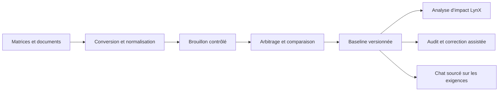

# AI for Requirements — atelier souverain d’ingénierie des exigences

AI for Requirements est une application locale dédiée à la construction, la
revue et l’exploitation d’une **baseline d’exigences**. Son cœur métier est
**LynX** : un moteur hybride déterministe/LLM qui analyse la cohérence d’une
arborescence, mesure l’impact des changements et produit des verdicts
explicables.

Le RAG est ici une brique de support : il sert à interroger la baseline et à
citer précisément les exigences. Le produit principal reste l’atelier de
gestion, de traçabilité et de vérification des exigences.

## Parcours principaux

| Parcours | Finalité |
|---|---|
| Importer | Convertir des matrices DJEM XLS/XLSX, des baselines JSON ou des documents DOC/DOCX/ODT/TXT |
| Arbitrer | Détecter les collisions, liens cassés et énoncés incomplets avant activation |
| Versionner | Préparer un brouillon isolé, comparer, approuver et restaurer une baseline |
| Analyser | Simuler un ajout, une modification, une suppression ou un remap |
| Auditer | Contrôler la matrice ou le seul périmètre impacté, puis proposer des corrections |
| Explorer | Parcourir la hiérarchie, les liens typés et la traçabilité |
| Interroger | Questionner la baseline dans un chat dont les citations renvoient aux identifiants d’exigences |

## Ce qui distingue LynX

- Analyses structurelles et d’allocation déterministes.
- Analyses sémantiques de pertinence, couverture, redondance et impact latent.
- Verdict unique : **VALIDE**, **ATTENTION** ou **BLOQUANT**.
- Boîte de verre montrant les entrées et sorties des agents.
- Changements proposés avant application ; aucune correction silencieuse.
- Baseline protégée par brouillons, comparaison, approbateur et motif
  d’activation.
- Exécution locale avec Ollama, MongoDB et Chroma.

Les résultats d’évaluation et la méthode sont détaillés dans
[`lynx/README.md`](lynx/README.md) et
[`lynx/METHODOLOGIE.md`](lynx/METHODOLOGIE.md).

## Architecture



- `conversion/` : import et normalisation.
- `lynx/src/` : modèle métier, orchestrateur, analyseurs, audit et traces.
- `api/lynx_api.py` et `api/lynx_corpus.py` : cycle de vie de la baseline.
- `api/lynx_chat.py` : index et chat réservés aux exigences.
- `web/src/components/requirements/` : atelier de revue et d’audit.
- `core/`, `retrieval/`, `indexing/` : socle RAG local partagé.

Voir [`docs/ARCHITECTURE.md`](docs/ARCHITECTURE.md) pour la carte technique.

## Démarrage rapide

Prérequis : Python 3.12, Node.js 20+, MongoDB et Ollama.

```bash
python -m venv .venv
source .venv/bin/activate
pip install -r requirements.txt
python -m spacy download fr_core_news_sm
ollama pull mistral-small3.2
ollama pull bge-m3
cp .env.example .env
python serve.py
```

Interface : <http://localhost:3000>. API : <http://localhost:8000>.

Pour un environnement isolé, utiliser `deploy/offline.sh prepare DESTINATION`
et suivre
[`docs/INSTALLATION_HORS_LIGNE.md`](docs/INSTALLATION_HORS_LIGNE.md).

## Vérification

```bash
python -m pytest
(cd lynx && python -m eval.run_eval --fast)
(cd web && npm run lint && npm run build)
```

## Limites

- PoC mono-poste : authentification, autorisations et multi-tenant ne sont pas
  encore fournis.
- Les verdicts sémantiques dépendent du modèle local et restent soumis à la
  validation de l’ingénieur.
- Les sources hétérogènes peuvent demander un arbitrage pendant l’import ; la
  baseline active n’est jamais remplacée avant validation.

## Documentation

- [`docs/ARCHITECTURE.md`](docs/ARCHITECTURE.md) — composants et flux.
- [`docs/SETUP_PORTABLE.md`](docs/SETUP_PORTABLE.md) — installation portable.
- [`docs/INSTALLATION_HORS_LIGNE.md`](docs/INSTALLATION_HORS_LIGNE.md) — livraison air-gap.
- [`lynx/README.md`](lynx/README.md) — moteur LynX et évaluation.
