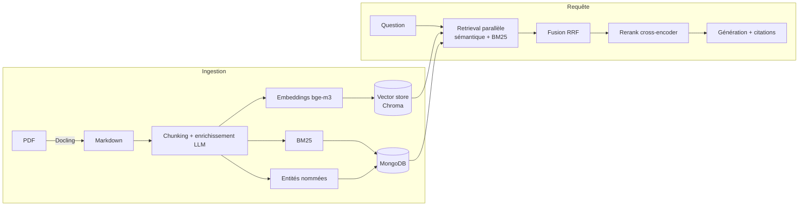

# AI for SSH : SaaS pour l'ingénierie de sécurité

**AI for SSH** réunit dans une **application 100 % locale** (aucune API externe) deux
outils complémentaires pour le travail sur les dossiers de sécurité (ANSSI / Critères
Communs). L'interface est un **front Next.js + API FastAPI** (`python serve.py`, par
défaut) ; l'ancienne **UI Streamlit** reste disponible en secours dans
[`legacy/`](legacy/README.md) le temps d'atteindre la parité complète
(`python serve.py --streamlit`) :

| Outil | Rôle | Documentation |
|---|---|---|
| **Outil RAG** (RAG documentaire) | Questions/réponses **sourcées** sur des cibles de sécurité : retrieval hybride, agent ReAct, serveur MCP, observabilité, **évaluation chiffrée**. | ce README |
| **AI for Requirements** (LynX) | **Seconde lecture** d'une matrice de traçabilité d'exigences : un système multi-agents mesure en temps réel l'impact d'un ajout/modif/suppression et rend un **verdict unique** (VALIDE / ATTENTION / BLOQUANT). | [`lynx/README.md`](lynx/README.md) |

Les deux outils partagent la même pile locale (Ollama : `mistral-small3.2` + `bge-m3`,
MongoDB) et le même thème sombre. La page d'accueil propose **un bouton par outil**.

> **Genèse — le merge.** AI for SSH est l'**unification de deux projets** auparavant
> distincts : le RAG documentaire (dépôt `rag_project`) et **LynX / AI for Requirements**.
> Le front Next.js sert les deux outils via l'API FastAPI (`api/rag.py`, `api/lynx_api.py`) ;
> l'UI Streamlit legacy embarque LynX **sans modifier son code** — voir
> [Intégration des deux outils](#intégration-des-deux-outils).

> **Ce que c'est** : une implémentation de référence **réutilisable et multi-OS** qui
> couvre l'essentiel de la feuille de route « AI Engineer » (RAG → agents → prod), avec
> une discipline *mesure-avant-d'optimiser*. **Ce que ce n'est pas** : une plateforme
> déployée à l'échelle. C'est un PoC abouti, pas un service en production (voir
> [Limites assumées](#limites-assumées)).

---

## Intégration des deux outils

**UI cible (Next.js).** Le front `web/` parle à l'API FastAPI `api/` : l'Outil RAG passe
par `api/rag.py`, l'**AI for Requirements** par `api/lynx_api.py` (qui wrappe `lynx/src`).
RAG et LynX sont **deux applications distinctes** choisies à l'accueil (navigations
séparées) — lancement : `python serve.py`.

**UI legacy (Streamlit).** `legacy/app/main.py` est l'ancien **hôte** unifié. Il expose
l'Outil RAG via sa barre latérale et l'AI for Requirements en plein écran :

- **Chargement non intrusif** : `_load_lynx()` importe `lynx/app.py` via `importlib` sous
  le nom de module unique `lynx_main`, avec `lynx/` ajouté au `sys.path` → les
  `from src import …` de LynX se résolvent dans `lynx/src`. **Le code de LynX n'est pas
  modifié** (il reste exploitable en standalone, cf. `lynx/README.md`).
- **Même process, mono-poste** : pas de second serveur ni d'appel réseau ; LynX conserve
  sa navigation interne (`ss.page`).
- **Thème** : `_LYNX_DARK_CSS` corrige uniquement les fonds clairs / textes quasi-noirs
  que LynX code en dur, pour l'aligner sur le sombre de l'hôte.
- **Navigation** : `view == "requirements"` (bouton d'accueil « AI for Requirements »)
  rend LynX ; le retour « AI for SSH » est un bouton intégré dans l'UI de LynX.

> Le fichier hôte s'appelle `main.py` et non `app.py` : le stem `app` collisionnerait
> avec le package `app/` (« 'app' is not a package »).

Chaque outil garde sa propre **évaluation chiffrée** : RAG → `evals/` ; LynX →
`lynx/eval/` (F1 micro 0.95 sur 196 cas).

---

## Pourquoi ce projet se distingue

La plupart des projets RAG s'arrêtent à « LangChain + une base vectorielle ». Ici, chaque
brique est **activable**, **mesurée**, et **retirée quand la donnée ne la justifie pas** :

- **Retrieval hybride** sémantique + BM25 + reranking cross-encoder, fusionnés par RRF,
  avec option parent-child.
- **Évaluation intégrée** (golden set + métriques type RAGAS) → décisions pilotées par la
  donnée, y compris des **suppressions** (voir plus bas).
- **Observabilité** (traces/spans souverains) qui a réellement servi à diagnostiquer (ex.
  « la génération = ~85 % de la latence »).
- **Agentique** : RAG-comme-outil, **serveur MCP**, **agent ReAct** streamé.
- **Souveraineté** : tout tourne en local (Ollama + modèles auto-hébergés), zéro donnée
  envoyée à un tiers.

## Résultats mesurés

**Qualité du retrieval** (golden set v2 de 30 Q/R ancrées dans le document,
`python -m evals.run_eval --mode retrieval` ; dernier run archivé dans
[`evals/last_eval.json`](evals/last_eval.json)) :

| Métrique | Valeur |
|---|---|
| hit@k (mots-clés attendus) | **0.64** |
| context recall | **0.53** |
| context precision | 0.29 |

→ Le retrieval est **fonctionnel mais perfectible** : c'est le **maillon identifié comme
prioritaire**, pas un acquis. La valeur du projet tient à la **démarche mesurée** (harnais
d'éval reproductible + observabilité) qui rend ce diagnostic possible et non à un score
brut. Les chiffres sont reproductibles ; ils ne sont pas figés dans le marbre.

**Décisions pilotées par la mesure (ce qui a été retiré).** Le harnais a servi à
*désactiver et supprimer* ce qui n'apportait rien sur ce corpus, pas seulement à ajouter :

- **GraphRAG** : effet nul mesuré (deux fois) → **retiré entièrement** (builder + retriever
  graphe, vue, toggles, config). Seule l'extraction d'entités (NER) reste, comme
  enrichissement des chunks.
- **Réécriture de requête LLM** : effet négatif + latence → **retirée** ; un simple
  *trim* qui préserve les acronymes *verbatim* fait mieux (`nlp/query_rewriter.py`).
- **Second backend vectoriel (Qdrant)** : jamais utilisé → **retiré** (dépendance
  `qdrant-client` incluse). L'abstraction `VectorStore` reste (point d'extension), avec un
  seul backend embarqué : **Chroma**.

Résultat cumulé de ce ménage : **~-12 % de lignes**, non-régression du retrieval vérifiée.

**Latence** (diagnostiquée via les traces) : la **génération domine (~85 %)** du temps sur
GPU contraint (un modèle 8B + grand contexte déborde la VRAM → offload CPU). Leviers livrés :
- *Mode rapide* (modèle plus léger + prompt épuré) : nettement plus court.
- *Agent retrieve-only* (1 seule génération finale au lieu d'une par recherche).
- *Streaming* : première pensée affichée en quelques secondes (ressenti type assistant
  conversationnel).

## Stack & techniques

| Domaine | Ce qui est implémenté |
|---|---|
| Embeddings / Vector DB / RAG | retrieval hybride + RRF + rerank cross-encoder, RAPTOR, parent-child, abstraction `VectorStore` (backend Chroma), évaluation chiffrée |
| Agents / MCP / Observabilité | tracing/spans, anti-injection, RAG-comme-outil, **serveur MCP**, **agent ReAct** streamé |
| Prompt engineering | ancrage + citations, auto-correction (ex-Self-RAG), prompts détaillé/épuré |
| Modèles | auto-hébergé (Ollama), **routage de modèles** par rôle |

## Architecture

Carte de lecture complète (couches, UI cible vs legacy, points d'entrée, flux) :
**[ARCHITECTURE.md](ARCHITECTURE.md)**.



Couches agentiques au-dessus : `tools/rag_tool.py` (RAG-comme-outil) → `rag_mcp_server.py`
(MCP) → `core/agent.py` (ReAct streamé). Observabilité : `utils/tracing.py`.

## Démarrage rapide

```bash
git clone https://github.com/laurykb/ai_for_requirements.git && cd ai_for_requirements
python -m venv .venv && source .venv/bin/activate   # Windows : .venv\Scripts\Activate.ps1
pip install -r requirements.txt                      # + requirements-gpu.txt si GPU NVIDIA
pip install -r lynx/requirements.txt                 # dépendances du module AI for Requirements
python -m spacy download fr_core_news_sm
ollama pull mistral-small3.2 && ollama pull bge-m3   # (+ llama3.2:3b en option pour le mode rapide)
cp .env.example .env
python serve.py            # démarre MongoDB + Ollama + le front Next.js + l'API FastAPI
# (ancienne UI Streamlit, le temps de la parité : python serve.py --streamlit)
```

Guide complet (modèles, GPU, gotchas par OS) : **[SETUP_PORTABLE.md](SETUP_PORTABLE.md)**.
Prérequis runtime : **Ollama** + **MongoDB**.

## Points d'entrée

| Commande | Rôle |
|---|---|
| `python serve.py` | UI cible : API FastAPI (`:8000`) + front Next.js (`:3000`) |
| `python serve.py --streamlit` | UI Streamlit legacy (`legacy/app`), le temps de la parité |
| `python -m evals.run_eval --mode retrieval` | évaluation chiffrée (retrieval) |
| `python -m core.agent "…"` | agent ReAct en CLI |
| `python rag_mcp_server.py` | serveur MCP (stdio) |
| `python diagnostic.py` | état des services + routage + vector store |
| `python -m pytest` | 154 tests unitaires (fonctions pures, hors-ligne) ; +121 pour LynX (`cd lynx && python -m pytest tests/`) |

## Structure

```text
api/         backend FastAPI (UI cible) : rag, sessions, documents, system, lynx_api
web/         front Next.js 16 (UI cible) — RAG et LynX, navigations séparées
lynx/        AI for Requirements : moteur multi-agents (src/) + prompts (skills/)
core/        orchestration (ask, ingest, llm_answer, agent, planner, model_router, self_rag)
retrieval/   retrieval hybride, fusion RRF, rerank, vector_store (abstraction Chroma)
indexing/    chunking, embeddings, BM25, persistance Mongo
nlp/         trim de requête, NER, enrichissement de chunks
evals/       harnais d'évaluation + golden set
utils/       tracing, sécurité, logging
env_config.py  config portable centralisée
legacy/app/  UI Streamlit historique (secours le temps de la parité)
```

## Limites assumées

C'est un **PoC de référence**, à prendre comme tel :

- **Corpus de démo** : le **multi-document est supporté** (un index BM25 par document
  fusionné en index global, filtrage par périmètre via le multiselect de l'UI), mais
  n'a été éprouvé qu'avec un document ingéré à la fois. Le passage à un corpus à grande
  échelle (nombreux documents, gros volumes) n'est pas encore validé.
- **Retrieval perfectible** : hit@k ~0.64 sur le golden set courant — le chantier
  d'amélioration prioritaire (chunking, pondération hybride, reranking) est ouvert.
- **Génération** : le LLM local est le maillon faible en qualité (français parfois
  imparfait) ; l'exactitude prime sur la vitesse pour des docs de sécurité.
- **Latence** : élevée sur petit GPU (offload CPU). Le vrai correctif est l'infra (GPU
  dédié ou modèle hébergé) ; le code (routage, streaming, abstractions) y est déjà prêt.
- **Couche de service en migration** : une **API FastAPI** (`api/`) + un **front Next.js**
  (`web/`) remplacent progressivement l'UI Streamlit ; conteneur / auth / multi-tenant
  restent hors périmètre du PoC (mono-poste souverain).

## Licence / contexte

Projet personnel d'apprentissage (AI Engineer). Documents ANSSI publics.
