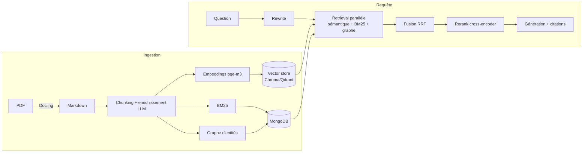

# RAG souverain & mesurable — implémentation de référence (PoC)

Pipeline **RAG hybride 100 % local** (aucune API externe) sur des documents techniques
de cybersécurité (cibles de sécurité ANSSI / Critères Communs), avec interface Streamlit,
agent ReAct, serveur MCP, observabilité et **harnais d'évaluation chiffré**.

> **Ce que c'est** : une implémentation de référence **réutilisable et multi-OS** qui
> couvre l'essentiel de la feuille de route « AI Engineer » (RAG → agents → prod), avec
> une discipline *mesure-avant-d'optimiser*. **Ce que ce n'est pas** : une plateforme
> déployée à l'échelle. C'est un PoC abouti, pas un service en production (voir
> [Limites assumées](#limites-assumées)).

---

## Pourquoi ce projet se distingue

La plupart des projets RAG s'arrêtent à « LangChain + une base vectorielle ». Ici, chaque
brique est **activable**, **mesurée** et **justifiée par des chiffres** :

- **Retrieval hybride** sémantique + BM25 + **GraphRAG** + reranking cross-encoder, fusionnés par RRF.
- **Évaluation intégrée** (golden set + métriques type RAGAS) → décisions pilotées par la donnée.
- **Observabilité** (traces/spans souverains) qui a réellement servi à diagnostiquer (ex. « la génération = 85 % de la latence »).
- **Agentique 2026** : RAG-comme-outil, **serveur MCP**, **agent ReAct** streamé.
- **Souveraineté** : tout tourne en local (Ollama + modèles auto-hébergés), zéro donnée envoyée à un tiers.

## Résultats mesurés

**Qualité du retrieval** (golden set de 10 Q/R, `python -m evals.run_eval --mode retrieval`) :

| Métrique | Valeur |
|---|---|
| hit@k (mots-clés attendus) | **0.93** |
| context recall | **0.90** |
| context precision | 0.66 |

→ Le **retrieval est solide** ; le maillon faible mesuré est la **génération** (qualité
du LLM local sur du français technique), pas la recherche.

**Latence** (diagnostiquée via les traces) : la **génération = ~85 %** du temps, car un
modèle 8B + contexte 16k déborde un GPU 8 Go (offload CPU). Leviers livrés :
- *Mode rapide* (modèle 3B + prompt épuré) : **~27 s vs ~150 s (~5,5×)**.
- *Agent retrieve-only* (1 seule génération finale au lieu d'une par recherche).
- *Streaming* : 1ʳᵉ pensée affichée à ~9 s (ressenti type Claude/ChatGPT).

**Décisions A/B** : GraphRAG mesuré **neutre** sur le retrieval factuel (+0,56 s/requête)
→ **désactivé par défaut**, mais activable pour les questions relationnelles.

## Stack & techniques

| Domaine | Ce qui est implémenté |
|---|---|
| Embeddings / Vector DB / RAG | retrieval hybride + RRF + rerank cross-encoder, RAPTOR, GraphRAG, parent-child, **2 backends** (Chroma/Qdrant), évaluation chiffrée |
| Agents / MCP / Observabilité | tracing/spans, anti-injection, RAG-comme-outil, **serveur MCP**, **agent ReAct** streamé |
| Prompt engineering | ancrage + citations, Self-RAG (auto-critique), prompts détaillé/épuré |
| Modèles | auto-hébergé (Ollama), **routage de modèles** par rôle |

## Architecture



Couches agentiques au-dessus : `tools/rag_tool.py` (RAG-comme-outil) → `rag_mcp_server.py`
(MCP) → `core/agent.py` (ReAct streamé). Observabilité : `utils/tracing.py`.

## Démarrage rapide

```bash
git clone <repo> rag_project && cd rag_project
python -m venv .venv && source .venv/bin/activate   # Windows : .venv\Scripts\Activate.ps1
pip install -r requirements.txt                      # + requirements-gpu.txt si GPU NVIDIA
python -m spacy download fr_core_news_sm
ollama pull llama3.1:8b && ollama pull bge-m3:567m
cp .env.example .env
python serve.py            # démarre MongoDB + Ollama + l'app d'un coup
# (ou, si les services tournent déjà : streamlit run app/app.py)
```

Guide complet (modèles, GPU, gotchas par OS) : **[SETUP_PORTABLE.md](SETUP_PORTABLE.md)**.
Prérequis runtime : **Ollama** + **MongoDB**.

## Points d'entrée

| Commande | Rôle |
|---|---|
| `streamlit run app/app.py` | UI (Chat / Documents / Graphe / **Observabilité** / Paramètres) |
| `python -m evals.run_eval --mode retrieval` | évaluation chiffrée (retrieval) |
| `python -m core.agent "…"` | agent ReAct en CLI |
| `python rag_mcp_server.py` | serveur MCP (stdio) |
| `python diagnostic.py` | état des services + routage + vector store |
| `python -m pytest` | 73 tests unitaires (fonctions pures, hors-ligne) |

## Structure

```text
app/         UI Streamlit unique
core/        orchestration (ask, ingest, llm_answer, agent, model_router, self_rag)
retrieval/   retrieval hybride, fusion RRF, rerank, vector_store (abstraction)
indexing/    chunking, embeddings, BM25, persistance Mongo
nlp/         rewrite, NER, GraphRAG, enrichissement
evals/       harnais d'évaluation + golden set
utils/       tracing, sécurité, logging
env_config.py  config portable centralisée
```

## Limites assumées

C'est un **PoC de référence**, à prendre comme tel :

- **Corpus de démo** : validé sur ~1 document (157 chunks). Le passage à un corpus
  multi-documents à grande échelle n'est pas éprouvé.
- **Génération** : le LLM local 8B est le maillon faible (français parfois imparfait) ;
  l'exactitude prime sur la vitesse pour des docs de sécurité → 8B par défaut.
- **Latence** : élevée sur petit GPU (offload CPU). Le vrai correctif est l'infra (GPU
  dédié ou modèle hébergé) ; le code (routage, streaming, abstractions) y est déjà prêt.
- **Pas de couche de service** (FastAPI/conteneur/auth/multi-tenant) : hors périmètre du PoC.

## Licence / contexte

Projet personnel d'apprentissage (AI Engineer). Documents ANSSI publics. Code MIT (au choix).
